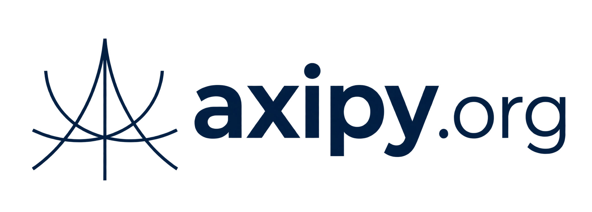

<p align="center">
  
</p>

<h1 align="center">AXIPY Protocol</h1>

<p align="center">
  Protocolo para distribuir publicações textuais assinadas entre nós independentes.
</p>

<p align="center">
  <strong>Especificação 0.2</strong> · Objetos e mensagens <code>v2</code>
</p>

---

## Visão geral

AXIPY define como um autor assina um post, como uma autoridade certificadora vincula sua chave pública a um certificado e como nós encontram, transferem e verificam esses objetos. Cada nó escolhe suas autoridades confiáveis, seus peers e sua política de aceitação.

**AXIPY** *(A-xí-pi)* combina *axios* (grego: válido, autêntico) e *ypy* (tupi: origem, raiz, princípio): **“a raiz autêntica”.**

Este repositório reúne a [especificação normativa](SPEC.md), perfis de transporte, schemas, vetores determinísticos e verificadores de referência. Ele **não é uma rede social executável** nem exige uma aplicação, linguagem, banco de dados ou provedor de hospedagem específico.

**Read in English:** [Project overview](README.en.md) · [Getting started](GETTING-STARTED.en.md).

## Por que AXIPY

O diferencial da AXIPY é a **confiança seletiva em autoridades certificadoras**. Nós podem usar a mesma infraestrutura de comunicação e reconhecer conjuntos diferentes de ACs. Um post pode ter formato, CID e assinaturas válidos sem que determinado nó reconheça sua AC ou decida distribuí-lo. Nenhuma autoridade global é exigida para participar do protocolo.

| Referência | Conceito relacionado | Decisão da AXIPY |
|---|---|---|
| [IPFS](https://docs.ipfs.tech/concepts/content-addressing/) | Identificação e recuperação de conteúdo por CID. | Define objetos sociais assinados e validação por certificados de ACs escolhidas por cada nó; não exige a rede IPFS. |
| [Nostr](https://github.com/nostr-protocol/nips/blob/master/01.md) | Eventos assinados por autores e distribuição por relays. | Usa certificados de ACs reconhecidas localmente e filtragem de `ANNOUNCE` por autoridade antes do download. |
| [AT Protocol](https://atproto.com/guides/overview) | Separação entre identidade, dados e serviços de rede. | Emprega certificados de ACs independentes para autores e CIDs de objetos completos; não define uma aplicação social obrigatória. |
| [Secure Scuttlebutt](https://ssbc.github.io/scuttlebutt-protocol-guide/) | Mensagens assinadas e replicação entre pares. | Identifica cada objeto por CID e não exige um log ordenado global ou por autor para validar posts. |

Essas comparações situam escolhas de projeto; os detalhes de compatibilidade estão na [especificação](SPEC.md) e nas [referências](REFERENCES.md).

## Como o protocolo funciona

1. **Certificação:** uma autoridade certificadora (AC) assina um certificado para a chave pública do autor, conforme sua própria política.
2. **Publicação:** o autor assina um post de texto puro com Ed25519. O post referencia o certificado por CID.
3. **Identificação:** o CIDv1 é calculado sobre os bytes JCS do objeto assinado completo. O mesmo objeto mantém o mesmo identificador em qualquer nó.
4. **Descoberta e transferência:** nós se autenticam no handshake, anunciam CIDs e decidem localmente se desejam obter cada bloco. Mensagens como `ANNOUNCE`, `DECISION`, `WANT` e `BLOCK` coordenam a troca.
5. **Validação e decisão:** quem recebe confere CID, schema, assinaturas e certificado; depois considera o reconhecimento local da AC e sua própria política para aceitar ou distribuir o objeto.

Bootstrap ajuda um nó a encontrar outros nós; não concede autoridade sobre conteúdo. A AC certifica autores; não precisa operar um nó. Um CID identifica conteúdo, mas sozinho não prova autoria confiável.

## Regras centrais

| Área | Revisão 0.2 |
|---|---|
| Conteúdo | Posts de texto puro, limitados a 16.384 bytes UTF-8; respostas referenciam outro post por CID. |
| Criptografia | Assinaturas Ed25519, chaves públicas JWK e JSON canonicalizado pelo RFC 8785 (JCS). |
| Identificadores | CIDv1, codec `raw` e hash `sha2-256` do objeto assinado completo. |
| Confiança | Cada nó mantém suas próprias autoridades confiáveis e decide quais peers e objetos aceita. |
| Comunicação | AXIPY Wire 2, com handshake, anúncios, busca de provedores e transferência de blocos. |
| Transporte | Perfis opcionais para TCP direto e libp2p. Uma ponte é necessária entre nós sem perfil em comum. |

Os detalhes normativos, inclusive prefixos de assinatura, formatos de objeto, limites e ordem de validação, estão em [SPEC.md](SPEC.md). Em caso de diferença, prevalece a especificação.

## Requisitos, políticas e recomendações

| Camada | Papel na implementação |
|---|---|
| **Requisitos normativos** | As regras de formato, JCS, CID, assinaturas, certificados, mensagens e rejeição estão apenas na [especificação](SPEC.md). Seus termos **DEVE**, **NÃO DEVE**, **RECOMENDA-SE** e **PODE** correspondem a `MUST`, `MUST NOT`, `SHOULD` e `MAY` das RFC 2119/8174. |
| **Políticas locais** | Cada operador escolhe ACs reconhecidas, peers, rate limiting, limites de armazenamento, retenção, propagação e como operar diante de snapshots de revogação atrasados ou indisponíveis. Essas escolhas não são condições de conformidade. |
| **Recomendações de implementação** | Práticas de diagnóstico e obtenção de dados recentes são identificadas como **não normativas**. Não acrescentam obrigações ao Wire 2. |

Validação criptográfica, reconhecimento de autoridade e decisão operacional são etapas distintas. `next_update` informa quando a AC prevê uma atualização; a passagem desse horário pode indicar desatualização, mas não invalida a assinatura do snapshot nem revoga certificados automaticamente. Consulte a [seção 4.3 da especificação](SPEC.md#43-descritores-e-revogação) e o [checklist de conformidade](CONFORMANCE.md).

O handshake Wire 2 autentica os nós e estabelece a sessão **sem transmitir listas de ACs reconhecidas**. Cada receptor verifica sua configuração local quando recebe um `ANNOUNCE` e, depois, o certificado associado ao objeto. Essa mudança é incompatível com o formato anterior do handshake Wire 2; veja [Migração](MIGRATION.md#handshake-wire-2-anterior-à-remoção-das-listas-de-acs).

## Documentação

| Documento | Para que serve |
|---|---|
| [Especificação](SPEC.md) | Regras normativas de objetos, CIDs, assinaturas, confiança e AXIPY Wire 2. |
| [Fluxos de mensagens](MESSAGE-FLOWS.md) | Cenários de cadastro, descoberta, propagação e recuperação. |
| [Perfil TCP](profiles/TCP.md) | Endereçamento e enquadramento de mensagens sobre TCP direto. |
| [Perfil libp2p](profiles/LIBP2P.md) | Stream `/axipy/2.0.0`, PeerId e descoberta opcional. |
| [Perfil de certificação](profiles/ISSUER.md) | Solicitação e emissão de certificados por um serviço de AC. |
| [Schemas](schemas/) | 30 schemas JSON Schema Draft 2020-12, incluindo 14 corpos de mensagens Wire. |
| [Exemplos](examples/) | Objetos assinados, CIDs e mensagens com chaves previsíveis **exclusivas para testes**. |
| [Checklist de conformidade](CONFORMANCE.md) | Requisitos verificáveis para implementadores. |
| [Decisões](DECISIONS.md) | Escopo, papéis e fronteiras definidos nesta revisão. |
| [Migração](MIGRATION.md) | Diferenças e incompatibilidades entre HTTP v0.1 e AXIPY Wire 2. |
| [Referências](REFERENCES.md) | Padrões adotados e relação com IPFS e libp2p. |
| [Introdução em inglês](README.en.md) | Visão geral, modelo de confiança e execução dos verificadores. |
| [Guia de início em inglês](GETTING-STARTED.en.md) | Comandos reais, vetores, confiança local e caminho para implementar um nó. |

O arquivo [legacy/openapi.json](legacy/openapi.json) documenta o **rascunho HTTP v0.1** e é mantido como referência histórica; ele não define o AXIPY Wire 2. Veja [legacy/README.md](legacy/README.md) antes de utilizar seus links de schema.

## Verificação local

Requisitos: **Node.js 22+** e, para a verificação cruzada, **Python 3.11+**. O verificador Node não precisa de pacotes npm.

```bash
git clone https://github.com/axipy/protocol.git
cd protocol
node tests/verify_node.mjs
```

Para validar também os schemas, assinaturas Ed25519 e CIDs com o verificador Python:

```bash
python -m pip install -r tests/requirements.txt
python tests/verify_vectors.py
```

Os exemplos assinados podem ser reproduzidos com `node tests/generate_vectors.mjs`. Esse comando regrava os arquivos de `examples/` de forma determinística. Consulte [SHA256SUMS](SHA256SUMS) para conferir os hashes dos arquivos listados ali. A implementação de referência em [reference/codec.mjs](reference/codec.mjs) demonstra JCS, Ed25519, CID e framing TCP; não é um servidor AXIPY.

## Licenciamento

O AXIPY Protocol, incluindo sua especificação, documentação e implementações de referência contidas neste repositório, é disponibilizado sob os termos da **Apache License, Version 2.0**.

São permitidos o uso, a modificação e a redistribuição, inclusive para fins comerciais, observadas as condições da licença.

Consulte o arquivo [LICENSE](LICENSE) para os termos completos.
